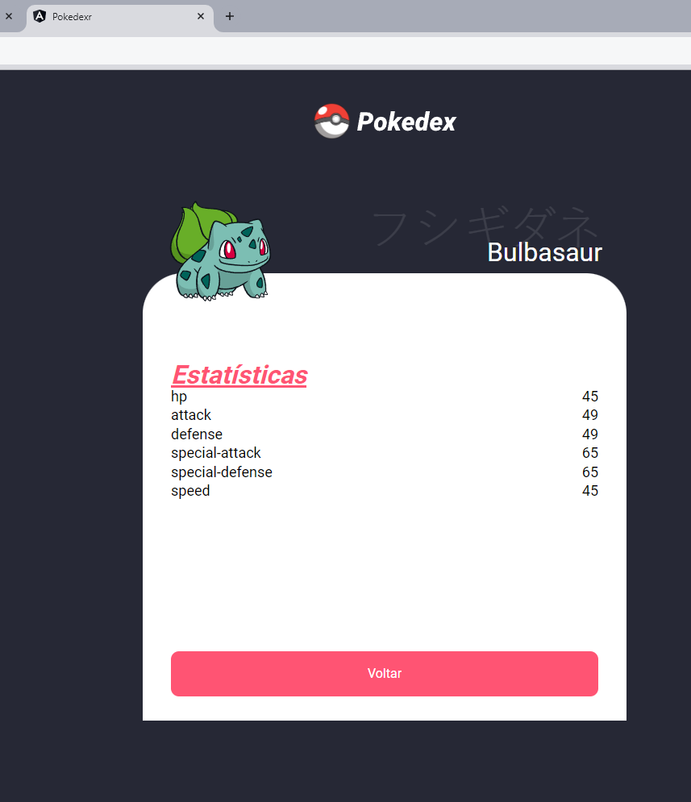

# Pokédex


## Sobre o Projeto

Este é um projeto de uma **Pokédex** simples que permite a busca e exibição de informações detalhadas sobre diferentes Pokémon. O projeto foi desenvolvido utilizando **Angular** no front-end e integra-se com uma API para buscar as informações dos Pokémon.

## Funcionalidades

- Busca de Pokémon pelo nome ou ID
- Exibição de detalhes como: nome, tipo, habilidades e imagem do Pokémon
- Interface responsiva e intuitiva

## Tecnologias Utilizadas

- **Angular**: Framework utilizado para o desenvolvimento do front-end.
- **TypeScript**: Linguagem de programação usada no projeto.
- **PokéAPI**: API pública utilizada para obter informações dos Pokémon.
- **Bootstrap**: Biblioteca utilizada para estilização e responsividade.

## Capturas de Tela


*Página Inicial da Pokédex*


*Exibição dos detalhes de um Pokémon*


*Exibição dos detalhes de um Pokémon*

## Como Executar o Projeto

### Pré-requisitos

Certifique-se de ter o **Node.js** e o **Angular CLI** instalados em sua máquina. Você pode verificar a instalação com os seguintes comandos:

```bash
node -v
npm -v
```

### Instalação

1. Clone o repositório:

   ```bash
   git clone https://github.com/anderoidy/pokedex1.git
   cd pokedex1
   ```

2. Instale as dependências:

   ```bash
   npm install
   ```

3. Inicie o servidor de desenvolvimento:

   ```bash
   ng serve
   ```

4. Acesse a aplicação no navegador:

   ```
   http://localhost:4200
   ```

## Contribuição

Contribuições são bem-vindas! Se você tiver sugestões ou melhorias, sinta-se à vontade para abrir uma issue ou enviar um pull request.

1. Fork este repositório
2. Crie uma branch para sua feature (`git checkout -b feature/sua-feature`)
3. Commit suas mudanças (`git commit -m 'Adiciona uma nova feature'`)
4. Push para a branch (`git push origin feature/sua-feature`)
5. Abra um Pull Request

## Licença

Este projeto está sob a licença MIT. Veja o arquivo [LICENSE](LICENSE) para mais detalhes.
